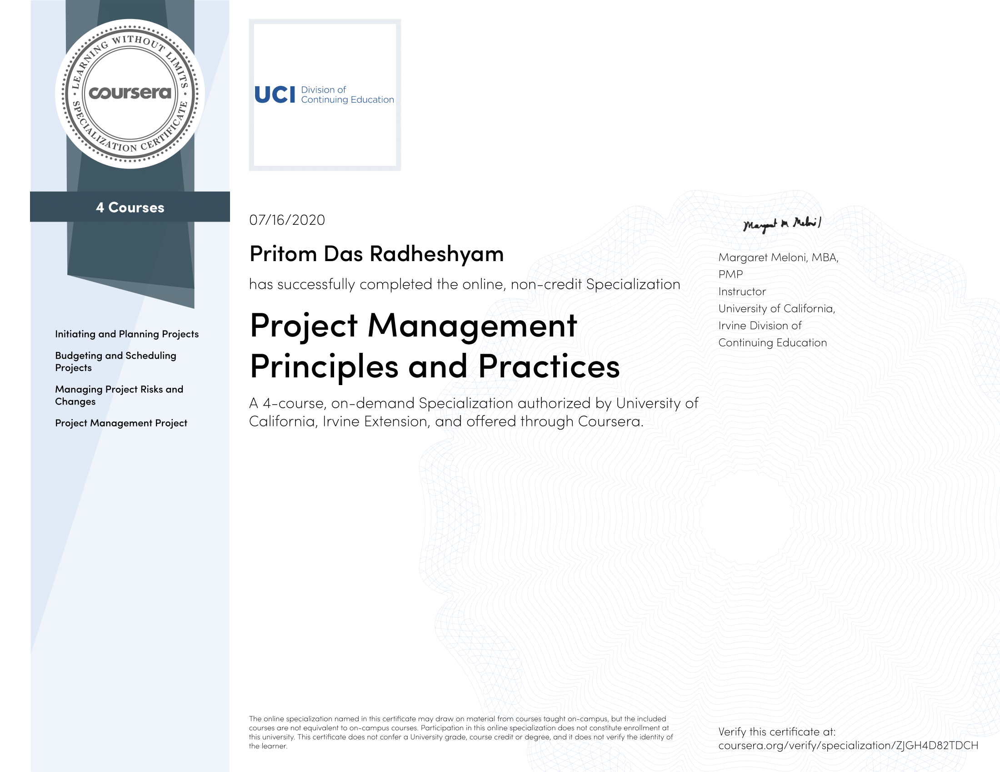
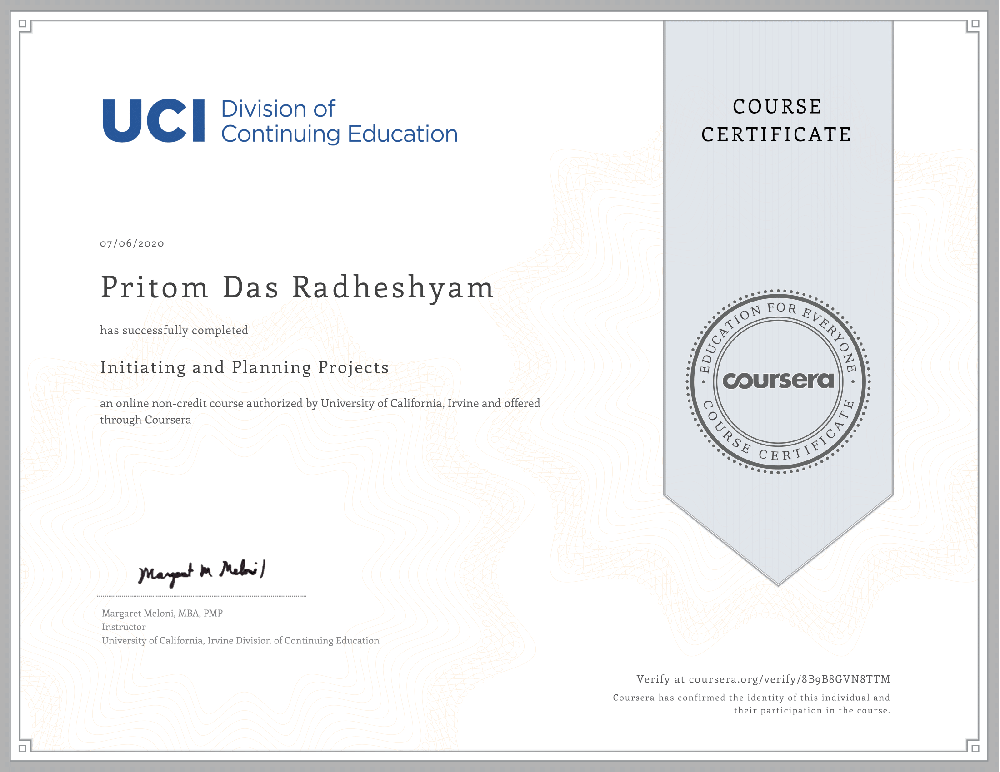
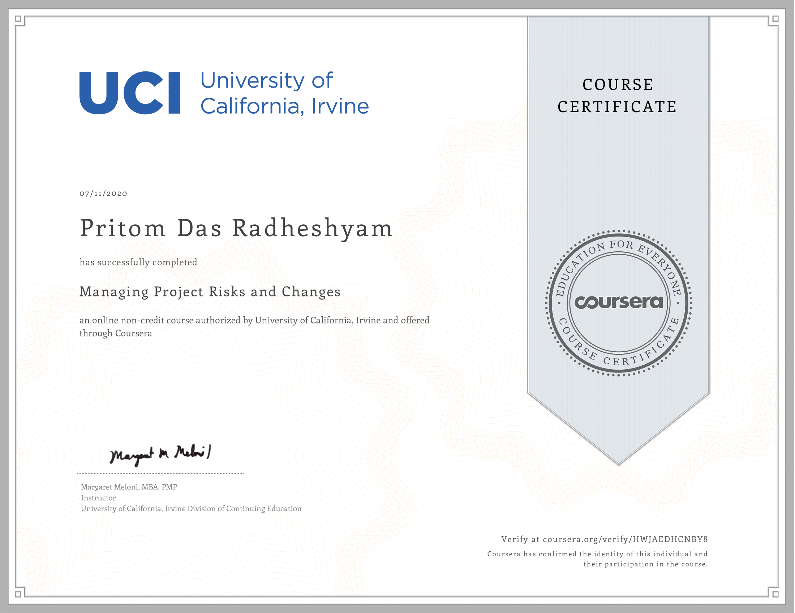

[![LinkedIn][linkedin-shield]][linkedin-url]
<!-- PROJECT LOGO -->
 

 
 <h3 align="center">Meet The Faculty</h3>

> Work Breakdown Structure, Work Schedule, Project Budget, RACI Chart, Risks & Issues, Sequence Diagram

<!-- ABOUT THE PROJECT -->

## About The Project
Project management has been proven to be the most effective method of delivering products within cost, schedule, and resource constraints. This intensive and hands-on series of capstone project was a part of the Coursera Specialization [Project Management Principles and Practices Specialization](https://www.coursera.org/specializations/project-management). This capstone project helped me to build the skills to ensure projects are completed on time and on budget while giving the user the product they expect. I gained a strong working knowledge of the basics of project management and can immediately use this knowledge to effectively manage work projects for any software development organisation. At the end of this series I was able to identify and manage the product scope, build a work breakdown structure, create a project plan, create the project budget, define and allocate resources, manage the project development, identify and manage risks, and understand the project procurement process.

### Project Description

#### Project Purpose

This project is based between the client (Blackboard Inc) and the vendor(PritomSolutions). The project is to add a new module to support automatic appointment scheduling to Blackboard’s existing web application for use in web browser. This solves a critical problem by enabling professors from different faculties to set up meetings with their students. It will be interactive, easy to use, and will eliminate dependecies. Earlier the existing Blackboard application didn’t have any feature of this sort and thus students and professors had to exchange multiple emails or in-person visits to set up personal appointments. After this module is established, the students can visit the professors even on their non office hours and can also utilise the Blackboard Collaborate for online meetings at the desired slots. This project is important for Blackboard to enable them to stand out from their competitiors who are providing such solutions to various other universities.

#### Objectives

PritomSolutions will launch an automatic appointment scheduler for Blackboard Inc. for their existing application. It is going to accomplished with a budget no more than $250k and with a schedule within 5 months. Increase customer base and sales by 5% within 120 days after the product launch date of Dec 7, 2020.

#### Initiating and Planning Projects

Successful projects require careful upfront planning. In this course, I learnt the key roles and responsibilities of the project manager and project team. I also learnt to answer some key questions upfront to help you meet project objectives: What will this project accomplish? Why is this project important? Who benefits from this project? How will we plan for successful outcomes?

Upon completing this course, I was able to grasp the following concepts clearly:
1.       Identify the key characteristics of a project
2.       Identify primary project constraints
3.       Define the role and responsibilities of the project manager
4.       Identify Project Organizational Structures
5.       Understand the definition of a Project Stakeholder
6.       Identify project stakeholders
7.       Identify information needs of the project stakeholders
8.       Define responsibility for managing stakeholder and controlling stakeholder engagement
9.       Define the purpose of using a project charter
10.     Summarize the key elements of a project plan
11.     Identify common sources of conflict within a project environment
12.     Describe the difference between authority and influence

#### Budgeting and Scheduling Projects

In this course, I learnt to create a project budget and schedule that delivers results under costs and time constraints. A good project schedule helps all team members’ work together to meet project objectives. A project budget with realistic cost constraints is also an essential bedrock of any project. I also learnt to plan and stick to time and cost constraints in order to ensure the success of the project.

Upon completing this course, I was able to grasp the following concepts clearly:
1.       Identify the resource needs of the project
2.       Decompose work packages into activities
3.       Define what is needed to estimate activity durations
4.       Define milestones and create a milestone schedule
5.       Determine the critical path and calculate float
6.       Describe the purpose of using leads and lags in a project schedule
7.       Estimate the quantities and costs of resources required to perform project activities
8.       Select one of three common cost estimating techniques to determine a project budget
9.       Use a responsibility assignment matrix to assign responsibilities
10.      Recognize the components of a project’s quality management plan

#### Managing Project Risks and Changes

This course helped me to learn about managing project risk effectively by identifying, analyzing, and communicating inevitable changes to project scope and objectives. I understood and practiced the elements needed to measure and report on project scope, schedule, and cost performance. You am well equipped with the tools to manage change in the least disruptive way possible for my team and other project stakeholders.

Upon completing this course, I was able to grasp the following concepts clearly:
1.       Define components of a communications management plan
2.       Understand the importance of communications channels
3.       Define the key elements needed to measure and report on project scope, schedule, and cost performance
4.       Identify project risk events
5.       Prioritize identified risks
6.       Develop responses for a high priority risk
7.       Identify and analyze changes to project scope
8.       Describe causes and effects of project changes
9.       Define the purpose of conducting a lessons learned session

#### Project Management Project

This capstone project was designed ot allow me to use the concepts and knowledge learnt through hands on practice. I have taken up a use case to implement an "Automatic Appointment Scheduler" for the Blackboard Application that University of Texas at Dallas uses for bring the education platform online. I had often noticed how professors sometimes encourage students to meet even during non-office hours. The Professor could never give an excat time when he/she could be free to meet up a student and there had to be many redundant email exchanges between the professors and the students. This project was about eliminating this process of uncertainity and adding an appointment scheduler in the pre-existing calender from Blackboard.

I had worked on the following to demonstrate my project management skills:
1.       Writing a narrative charter statement
2.       Creating a work breakdown structure
3.       Sequencing project activities
4.       Building a project schedule
5.       Creating a project budget
6.       Creating a responsibility assignment matrix
7.       Identifying project risks and define responses for those risks

I had also extensivley used Microsft Project 2019 Professional for many of the tasks. It was a great learning experience to work around in sunch an amazing tool along with Microsft Excel for effective Project Management. All these files are opensourced in the repository for the learning purpose of students in the domain of Project Management.

<!-- CONTACT -->

## Contact
Pritom Das Radheshyam - [Portfolio Website](https://pritom.uwu.ai/)

<!-- MARKDOWN LINKS & IMAGES -->
<!-- https://www.markdownguide.org/basic-syntax/#reference-style-links -->

[linkedin-shield]: https://img.shields.io/badge/-LinkedIn-black.svg?style=flat-square&logo=linkedin&colorB=555
[linkedin-url]: https://www.linkedin.com/in/you-found-pritom
[product-screenshot]: images/screenshot.jpg
