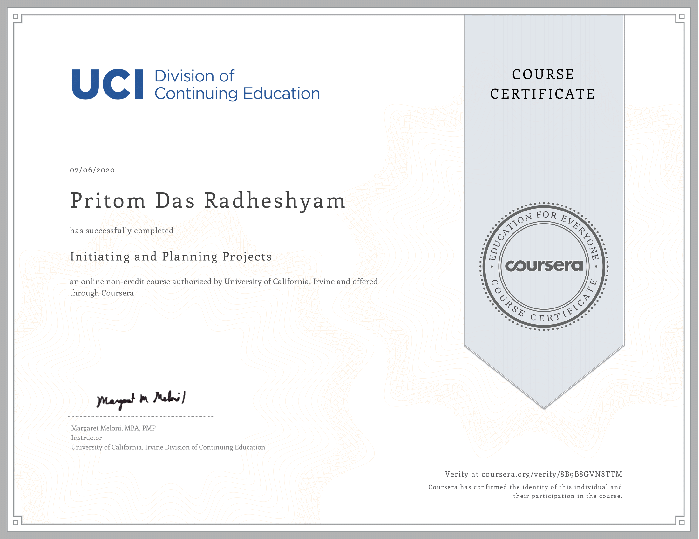

[![LinkedIn][linkedin-shield]][linkedin-url]
<!-- PROJECT LOGO -->
<br />

<p align="center">
 
 <h3 align="center">Meet The Faculty</h3>
</p>


> Work Breakdown Structure, Work Schedule, Project Budget, RACI Chart, Risks & Issues, Sequence Diagram

<!-- ABOUT THE PROJECT -->

## About The Project
Project management has been proven to be the most effective method of delivering products within cost, schedule, and resource constraints. This intensive and hands-on series of capstone project was a part of the Coursera Specialization [Project Management Principles and Practices Specialization](https://www.coursera.org/specializations/project-management). This capstone project helped me to build the skills to ensure projects are completed on time and on budget while giving the user the product they expect. I gained a strong working knowledge of the basics of project management and can immediately use this knowledge to effectively manage work projects for any software development organisation. At the end of this series I was able to identify and manage the product scope, build a work breakdown structure, create a project plan, create the project budget, define and allocate resources, manage the project development, identify and manage risks, and understand the project procurement process.


### Project Description

#### Project Purpose

This project is based between the client (Blackboard Inc) and the vendor(PritomSolutions). The project is to add a new module to support automatic appointment scheduling to Blackboard’s existing web application for use in web browser. This solves a critical problem by enabling professors from different faculties to set up meetings with their students. It will be interactive, easy to use, and will eliminate dependecies. Earlier the existing Blackboard application didn’t have any feature of this sort and thus students and professors had to exchange multiple emails or in-person visits to set up personal appointments. After this module is established, the students can visit the professors even on their non office hours and can also utilise the Blackboard Collaborate for online meetings at the desired slots. This project is important for Blackboard to enable them to stand out from their competitiors who are providing such solutions to various other universities.

#### Objectives

PritomSolutions will launch an automatic appointment scheduler for Blackboard Inc. for their existing application. It is going to accomplished with a budget no more than $250k and with a schedule within 5 months. Increase customer base and sales by 5% within 120 days after the product launch date of Dec 7, 2020.

#### Initiating and Planning Projects


Successful projects require careful upfront planning. In this course, I learnt the key roles and responsibilities of the project manager and project team. I also learnt to answer some key questions upfront to help you meet project objectives: What will this project accomplish? Why is this project important? Who benefits from this project? How will we plan for successful outcomes?

Upon completing this course, I was able to grasp the following concepts clearly:
1.       Identify the key characteristics of a project
2.       Identify primary project constraints
3.       Define the role and responsibilities of the project manager
4.       Identify Project Organizational Structures
5.       Understand the definition of a Project Stakeholder
6.       Identify project stakeholders
7.       Identify information needs of the project stakeholders
8.       Define responsibility for managing stakeholder and controlling stakeholder engagement
9.       Define the purpose of using a project charter
10.     Summarize the key elements of a project plan
11.     Identify common sources of conflict within a project environment
12.     Describe the difference between authority and influence

**DAG Operations**

The Airflow DAG is set up to execute the following steps sequentially.

1. Start execution as per schedule
2. Create the AWS Redshift cluster
3. Upload static datasets to AWS S3
4. Stream tweet data to AWS Kinesis to ingest into AWS S3
5. Create tables on AWS Redshift
6. Stage the data from AWS S3 on AWS Redshift
7. Perform data quality check on the staging tables
8. Transform and load data into facts table 
9. Perform data quality check on the facts tables
10. Transform and load data into dimensional table 
11. Perform data quality check on the dimensional tables
12. Destroy the cluster
13. End execution

> NB: With slight modification to the code, we can remove the Step 4 which streams data from the DAG and manually run the `stream_tweets.py`. This would enable us to extract tweet from specific time of day when the script is run. 

> NB: Step 2 and Step 12 are only for demonstration purpose. By creating a separate DAG to create cluster which executes only once, we can deploy this model to run daily until manual interruption.

#### Run ETL to Model the Data

The tweet data is typically generated at high speeds, especially in the `Real time Stream mode`, and normal data uploading techniques often fails. We use [AWS Kinesis](https://aws.amazon.com/kinesis/), which is a real time streaming and analysis service provided by AWS, to ingest tweet data into [AWS S3](https://aws.amazon.com/s3). AWS S3 acts a data lake storing our static and dynamic data for further processing. We then stage the tweet data, temperature data and happiness index data on [AWS Redshift](https://aws.amazon.com/redshift/) and convert them to fact and dimensions tables (Star Schema) on AWS Redshift. This would allow us to answer insightful questions on the data and can be used for business analytics. 

Implementing the data stores and data warehouses on the cloud brings in lots of advantages. We can scale our resources vertically or horizontally as per our real time requirements with few clicks (or CLI commands). We can do the above much faster than implementing an on-premise resource with much less human working hours. We can also provide efficient access to our applications around the world by spreading our deployments to multiple regions.

##### Data quality checks

* Integrity checks

  The relational database has integrity checks in place with the use of PRIMARY KEYs in fact and dimensional tables. These keys ensure that these values are UNIQUE and NOT NULL. The tables for Happiness Index and Temperature data have NOT NULL constraints for their entries - since we have already explored them and made sure that they are not NULL. The LOCATION attribute in the tweets table has the NOT NULL constraint since we intend to use that field for analytics. We cannot be stringent about the NULL values in other attributes of the tweets table since the data is dynamic and may have missing values in fields we do not require in this project.

* Source/Count checks

  Source count checks have been implemented in the Airflow DAGs using the CheckOperator and ValueCheckOperator. Since we already know the number of entries in the static datasets we could use the ValueCheckOperator to check all the entries have been inserted. Since we don't know the entries for dynamic tweet data we could use the CheckOperator to check any entries have been made to the table.


### Tools and Technologies used

* [python](https://www.python.org/)

* [Apache Airflow](https://airflow.apache.org/) 

  Apache Airflow is an open-source tool for orchestrating complex computational workflows and data processing pipelines. It is a platform to programmatically author, schedule, and monitor workflows. When workflows are defined as code, they become more maintainable, versionable, testable, and collaborative. We use Airflow to author workflows as directed acyclic graphs (DAGs) of tasks. The Airflow scheduler executes your tasks on an array of workers while following the specified dependencies. Rich command line utilities make performing complex surgeries on DAGs a snap. The rich user interface makes it easy to visualize pipelines running in production, monitor progress, and troubleshoot issues when needed.

* [Amazon Web Services](https://aws.amazon.com/)

  * [AWS Kinesis](https://aws.amazon.com/kinesis/)

    Amazon Kinesis makes it easy to collect, process, and analyze real-time, streaming data so you can get timely insights and react quickly to new information. Amazon Kinesis offers key capabilities to cost-effectively process streaming data at any scale, along with the flexibility to choose the tools that best suit the requirements of your application. With Amazon Kinesis, we can ingest real-time data stream such as tweet data for machine learning, analytics, and other applications. Amazon Kinesis enables us to process and analyze data as it arrives and respond instantly instead of having to wait until all your data is collected before the processing can begin.

  * [AWS Comprehend](https://aws.amazon.com/comprehend/)

    Amazon Comprehend is a natural language processing (NLP) service that uses machine learning to find insights and relationships in text. We do not have to manually go through the process of training and deploying a machine learning model. In this project we use this tool for extracting sentiment of the Twitter tweet. The service identifies the language of the text; extracts key phrases, places, people, brands, or events; understands how positive or negative the text is; analyzes text using tokenization and parts of speech; and automatically organizes a collection of text files by topic. 

  * [AWS S3](https://aws.amazon.com/s3/)

    Amazon Simple Storage Service (Amazon S3) is an object storage service that offers industry-leading scalability, data availability, security, and performance. This means that we can use it to store and protect any amount of data for a range of use cases, such as big data analytics. Amazon S3 is designed for high of durability, and stores data for millions of applications for companies all around the world. In this project, we use this tool to store our static and dynamic datasets - acting as a data lake for our data. 

  * [AWS Redshift](https://aws.amazon.com/redshift/)

    Amazon Redshift is the most popular and fastest cloud data warehouse. Redshift is a fully-managed petabyte-scale cloud based data warehouse product designed for large scale data set storage and analysis. It is also used to perform large scale database migrations. Redshift’s column-oriented database is designed to connect to SQL-based clients and business intelligence tools, making data available to users in real time. In this project, we use this tool to warehouse our data so that we could easily scale it when necessary. 

    

## Apache Airflow Orchestration 

### DAG Structure

The DAG parameters are set according to the following :

- The DAG does not have dependencies on past runs
- DAG has schedule interval set to daily
- On failure, the task are retried 3 times
- Retries happen every 5 minutes
- Catchup is turned off
- Email are not sent on retry

The DAG dependency graph is given below.


## What if ?

This section discusses strategies to deal with the following three key scenarios:

1. Data is increased 100x. 
2. Data pipeline is run on daily basis by 7 am every day.
3. Database needs to be accessed by 100+ users simultaneously.

#### 1. Data is increased 100x

In this project we have used scalable, fully managed cloud services to store and process our data throughout. As mentioned earlier, we can easily scale our resources vertically or horizontally with few clicks to tackle this scenario. Increased resources for AWS Redshift would allow us to load larger static datasets faster. For the increased volume of streaming tweet data, we could either upload the tweets in batches rather than individually or use multiple AWS Kinesis delivery streams to ingest data parallely.

#### 2. Data pipeline is run on a daily basis by 7 am every day

As the static datasets do not change on a daily basis, the major challenge here is to process the a day's amount of captured tweets in an acceptable time. AWS Kinesis stores the data in AWS S3 partitioned by yearly/monthly/daily/hourly blocks. This makes it easy to run tasks in parallel DAGs with reduced data volume. Hence, the entire data could be processed within the stipulated time.

#### 3. Database needs to be accessed by 100+ users simultaneously

We are using cloud based services, which can be easily given access to the 100+ users. To improve the performance, we need more CPU resources with increased user count. Using a distributed database, we can to improve oour replications and partitioning to get faster query results for each user. If a group of users work on a specific subset of data or have an expensive query, we can also explore creating duplicate tables for them (if possible). 


## Project structure

Files in this repository:

|  File / Folder   |                         Description                          |
| :--------------: | :----------------------------------------------------------: |
|     airflow      | Folder at the root of the project, where DAGs and associated python scripts are stored |
|     datasets     | Folder at the root of the project, where static datasets are stored |
|      images      |  Folder at the root of the project, where images are stored  |
|       sql        | Folder at the root of the project, where SQL commands are stored |
|    config.cfg    |                  Sample configuration file                   |
| requirements.txt |             Python environment requirements file             |
|   DATADICT.md    | Data Dictionary file with explanation of attributes of tables |
|    README.md     |                         Readme file                          |


<!-- GETTING STARTED -->

## Getting Started

Clone the repository into a local machine using

```sh
git clone https://github.com/PritomDas/Mastery-in-Data-Engineering/tree/master/Udacity%20Data%20Engineering%20Nano%20Degree
```

### Prerequisites

These are the prerequisites to run the program.

* python 3.8.2 ( as of my current installation )
* Twitter developer account and credentials
* Static datasets (from Kaggle)
* AWS IAM credentials
* AWS Kinesis Firehose
* AWS Comprehend
* AWS Redhift
* Apache Airflow
* python environment requirements: [requirements.txt](requirements.txt)

### How to run

Follow the steps to extract and load the data into the data model.

1. Set up Apache Airflow.

2. Navigate to `Projects` and then to `6. Capstone Project` folder.

3. Install requirements by

   ```sh
   pip install -r requirements.txt
   ```

4. Edit and fill in `config.cfg` as per requirements.

5. Download the static datasets into [datasets](./datasets) directory.

6. Trigger Airflow DAG ON.

7. Verify the DAG execution by executing analytics tasks.


<!-- CONTACT -->

## Contact
Pritom Das Radheshyam - [Portfolio Website](https://pritom.uwu.ai/)


<!-- MARKDOWN LINKS & IMAGES -->
<!-- https://www.markdownguide.org/basic-syntax/#reference-style-links -->

[linkedin-shield]: https://img.shields.io/badge/-LinkedIn-black.svg?style=flat-square&logo=linkedin&colorB=555
[linkedin-url]: https://www.linkedin.com/in/you-found-pritom
[product-screenshot]: images/screenshot.jpg
